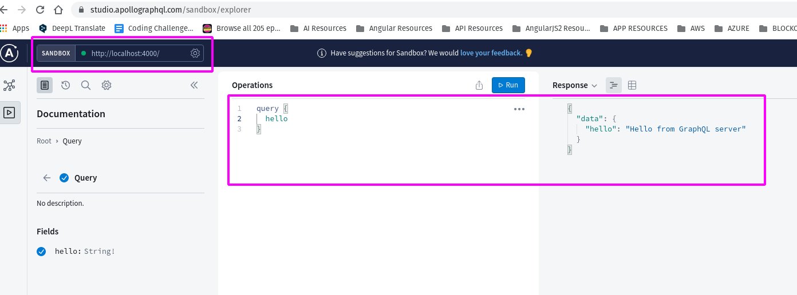

# PickFu Backend

Set a minimum GraphQL server at [`src/index.ts`](src/index.ts)  
Then run dev server

```bash
yarn dev
```



## Connect MongoDB

To persist data, we'll use [`Mongo Atlas`](https://account.mongodb.com/account/login)  
The connection URI is kept in `.env` file that is untracked. but will be provided  
The db connection is established at [`src/db.ts`](src/db.ts)  
at src/db.ts:

```typescript
async function connectToDatabase(): Promise<{
  client: MongoClient
  db: Db
  collections: DbCollections
}> {
  // check for database connection string and db name
  if (!uri || !dbName) {
    throw new Error('No URI available for MongoDB connection')
  }
  // if have cached use it
  if (cachedClient && cachedDb && collections) {
    return { client: cachedClient, db: cachedDb, collections }
  }
  // const client = new MongoClient(uri);
  try {
    const client = await MongoClient.connect(uri)
    // connect to specific database
    const db = await client.db(dbName)
    // set cache
    cachedClient = client
    cachedDb = db
    collections = { responses: db.collection('responses') }
    return { client, db, collections }
  } catch (e: any) {
    throw new Error(e?.message ?? 'error connecting to MongoDB')
  }
}
```

This `connectToDatabase` function is imported in [`index.ts`](src/index.ts)  
Where its used in the construcor of our `datasource`

```typescript
const mount = async () => {
  const { collections } = await connectToDatabase()
  const { responses } = collections
  if (!responses) {
    throw new Error('No DB connection available')
  }
  const server = new ApolloServer({
    typeDefs,
    resolvers,
    dataSources: () => ({
      responses: new ResponseDataSource(responses),
    }),
  })
  try {
    const { url } = await server.listen({ port })
    console.log(`GraphQL server running at ${url}`)
  } catch (error) {
    console.error(`GraphQL server error: ${error}`)
  }
}
```

The `ResponseDataSource` class is an Apollo Datasource, that uses our MongoDB collection  
to read/write to database the class code is at; [`src/datasources/ResponsesDataSource.ts`](src/datasources/ResponsesDataSource.ts)  
Then this datasource are passed into context to all resolvers
at resolvers functions we use it like this:
At `src/resolvers.ts`

```typescript
export const resolvers: IResolvers = {
  Query: {
    hello: () => 'Hello from GraphQL server',
    allResponses: (
      _parent,
      _args,
      { dataSources }: { dataSources: { responses: ResponseDataSource } }
    ) => {
      const { responses } = dataSources
      return responses.getAllResponses()
    },
  },
  Mutation: {
    createResponse: (
      _,
      { input }: { input: { response: string } },
      { dataSources }: { dataSources: { responses: ResponseDataSource } }
    ) => {
      const { response } = input
      const { responses } = dataSources

      return responses.createResponse(response)
    },
  },
}
```

Finally we test the server:


